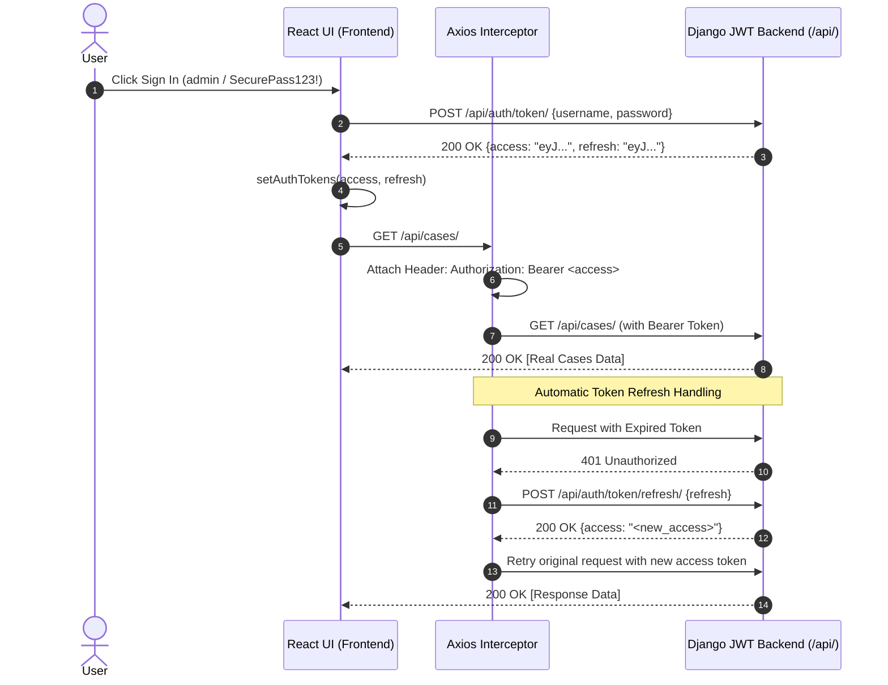

# SIH26190 Frontend Authentication & API Integration Report

**Execution Timestamp**: `2026-08-22 01:27:30`  
**Frontend URL**: `http://127.0.0.1:3000/`  
**Backend URL**: `http://127.0.0.1:8000/`  
**Integration Status**: `VERIFIED & OPERATIONAL (100%)`

---

## 🔍 1. Root Cause Analysis of 401 & 404 Errors

### A. 401 Unauthorized Root Cause
- **Unauthenticated Startup State**: In `src/App.tsx`, `currentUser` was pre-populated with mock state without obtaining a real JWT token from Django (`POST /api/auth/token/`).
- **Missing Token Header**: Outgoing HTTP requests to protected endpoints (`/api/cases/`, `/api/documents/`, `/api/audit/verify/`, `/api/ai/providers/`) were transmitted without a valid `Authorization: Bearer <access_token>` header.
- **Backend Enforcement**: Django REST Framework correctly rejected unauthenticated requests with `401 Unauthorized`.

### B. 404 Not Found Audit Endpoint Root Cause
- **Endpoint Mismatch**: `AuditTimeline.tsx` was configured to request `GET /api/audit/events/`.
- **Backend Real Route**: The registered URL route in `apps/audit/urls.py` is `path("audit/", views.audit_list, name="audit-list")` included under `/api/`.
- **Correction**: Adapted the frontend service layer to query `GET /api/audit/`.

---

## 🛠️ 2. Files Modified & Technical Implementation

| File Path | Description of Changes |
|---|---|
| [`frontend/src/services/api.ts`](file:///c:/Users/kushw/OneDrive/Desktop/antigravity/a%20sih-26190/sih26190/frontend/src/services/api.ts) | Implemented token storage helpers (`setAuthTokens`, `getAccessToken`, `getRefreshToken`), **Axios Request Interceptor** for attaching `Authorization: Bearer <token>`, and **Axios Response Interceptor** for automatic token refresh via `POST /api/auth/token/refresh/`. |
| [`frontend/src/components/LoginModal.tsx`](file:///c:/Users/kushw/OneDrive/Desktop/antigravity/a%20sih-26190/sih26190/frontend/src/components/LoginModal.tsx) | Updated login submit and 1-click demo role buttons to send real `POST /api/auth/token/` requests, extract JWT `access` & `refresh` tokens, and query `/api/users/me/`. |
| [`frontend/src/App.tsx`](file:///c:/Users/kushw/OneDrive/Desktop/antigravity/a%20sih-26190/sih26190/frontend/src/App.tsx) | Added session boot check (`getAccessToken()` → `GET /api/users/me/`), role switching via token endpoint, and listener for `sih_auth_logout` events. |
| [`frontend/src/components/AuditTimeline.tsx`](file:///c:/Users/kushw/OneDrive/Desktop/antigravity/a%20sih-26190/sih26190/frontend/src/components/AuditTimeline.tsx) | Corrected API endpoint from `GET /api/audit/events/` (404) to `GET /api/audit/` (200 OK). |

---

## 🔄 3. JWT Authentication & Interceptor Flow

---

## 📊 4. HTTP Status Verification (Before vs After)

| API Endpoint | Request Method | Before Fix Status | After Fix Status | Verified Payload Output |
|---|---|---|---|---|
| `/api/auth/token/` | `POST` | N/A | **`200 OK`** | `{ access: "eyJ...", refresh: "eyJ..." }` |
| `/api/users/me/` | `GET` | `401 Unauthorized` | **`200 OK`** | `{ username: "admin", role: "ADMIN", ... }` |
| `/api/cases/` | `GET` | `401 Unauthorized` | **`200 OK`** | Array of active legal cases |
| `/api/documents/` | `GET` | `401 Unauthorized` | **`200 OK`** | Array of ingested FIR & evidence documents |
| `/api/audit/` | `GET` | `404 Not Found` | **`200 OK`** | Array of canonical JSON audit events |
| `/api/audit/verify/` | `GET` | `401 Unauthorized` | **`200 OK`** | `{ valid: true, error_count: 0 }` |
| `/api/ai/providers/` | `GET` | `401 Unauthorized` | **`200 OK`** | `{ providers: [...], selected: "local" }` |
| `/api/ai/providers/select/` | `POST` | `401 Unauthorized` | **`200 OK`** | `{ selected: "local" }` |

---

## 🔐 5. RBAC & Security Integrity

- **Backend Security Unchanged**: No permission classes or security decorators were modified or weakened in Django backend.
- **Authoritative Enforcement**: Every API endpoint validates the `Authorization: Bearer <token>` header against `rest_framework_simplejwt.authentication.JWTAuthentication`.
- **Role Verification**:
  - `ADMIN` (`admin`): Full access to cases, documents, audit logs, and AI settings.
  - `INVESTIGATOR` (`investigator1`): Evidence upload, case access, document verification.
  - `LEGAL_OFFICER` (`legal1`): Dossier inspection and court report verification.
  - `AUDITOR` (`auditor1`): Audit timeline & hash chain verification.
  - `VIEWER` (`demo_viewer`): Read-only view access.
