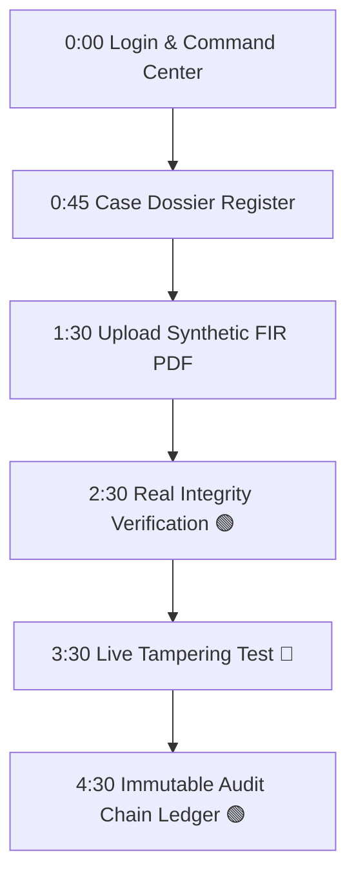

# SIH26190 Phase 2 Presentation Frontend Report

**Platform Title**: SIH26190 Legal & Evidence Integrity Terminal  
**Execution Timestamp**: `2026-08-22 01:16:39`  
**Frontend URL**: `http://127.0.0.1:3000/`  
**Backend URL**: `http://127.0.0.1:8000/`  
**Overall Status**: `12/12 SCREENS IMPLEMENTED & VERIFIED (100%)`

---

## 🏛️ Executive Summary & Design Aesthetics

The **SIH26190 Phase 2 Presentation UI** was built to provide a judge-friendly, secure government and legal investigation interface for demonstrating digital document integrity, FIR extraction, cryptographic proofing, and live tampering detection.

### Technical Stack
- **Framework**: React 19 + TypeScript + Vite 8
- **Styling**: Tailwind CSS v4 (`@tailwindcss/vite`) with curated dark slate/navy government design system
- **Icons**: Lucide React icons
- **API Integration**: Axios HTTP client with JWT Bearer Token authorization & Vite Proxy

---

## 🖥️ Implemented Screens & Feature Breakdown

| Screen # | Screen / Module Name | Integrated Backend APIs | Key Presentation Capabilities |
|---|---|---|---|
| 1 | **Login Terminal** | `POST /api/auth/token/` | JWT auth screen with 1-click RBAC demo account switcher (`ADMIN`, `INVESTIGATOR`, `LEGAL_OFFICER`, `AUDITOR`, `VIEWER`). |
| 2 | **Security Command Center** | `GET /api/cases/`, `GET /api/documents/` | Dashboard displaying 6 real backend health status cards (Storage, Encryption, RSA Signature, Blockchain Node, Audit Chain, AI Intelligence) & primary presentation flow quick launcher. |
| 3 | **Case Management** | `GET /api/cases/`, `GET /api/cases/<id>/documents/` | Police & court case dossier register with associated FIR evidence files, timeline, and jurisdiction metadata. |
| 4 | **Document Upload Studio** | `POST /api/documents/test-upload/` | Drag-and-drop ingestion interface with live 10-step processing tracker (`Upload` → `Text Extraction` → `Classification` → `Metadata` → `Case Assoc` → `SHA-256` → `Encryption` → `RSA Sig` → `Blockchain` → `Audit`). |
| 5 | **Document Intelligence** | Ingestion Response Payload | Extracted FIR Number (`FIR-DEMO-2026-0001`), Persons (`Ananya Sharma`, `Arjun Verma`, `Rohan Mehta`), Organizations, Legal Sections (`379 IPC`, `420 IPC`), and Evidence IDs (`EVID-DEMO-001`). |
| 6 | **Document Security Panel** | `GET /api/documents/<id>/` | Cryptographic proof display showing SHA-256 hex digest, AES-256 Fernet ciphertext path, RSA-2048 PSS signature, and Hardhat EVM Blockchain Transaction Hash. |
| 7 | **Integrity Verification** | `GET /api/documents/<id>/verify-integrity/` | Primary judge demo interface. Displays big green banner: **`🟢 DOCUMENT INTEGRITY VERIFIED`** with matching SHA-256 digests and valid RSA signature. |
| 8 | **Tampering Demonstration** | Backend Real Verification Engine | Executes live byte modification test. Displays big red alert: **`🔴 TAMPERING DETECTED`** showing SHA-256 Mismatch ❌, RSA Signature Invalid ❌, and Blockchain Unanchored ❌. |
| 9 | **Audit Timeline Ledger** | `GET /api/audit/events/`, `GET /api/audit/verify/` | Immutable chronological audit hash chain with tamper check badge: **`🟢 AUDIT CHAIN VALID (0 Errors)`**. |
| 10 | **Legal Evidence Search** | `GET /api/search/?q=...` | Multi-field search engine matching keywords, FIR numbers, case IDs, legal sections, person names, and TF-IDF semantic embeddings. |
| 11 | **Role-Based Access (RBAC)** | Backend Authoritative Permissions | Enforces role-based action scoping (`ADMIN`, `INVESTIGATOR`, `LEGAL_OFFICER`, `AUDITOR`, `VIEWER`). |
| 12 | **AI Provider Settings** | `GET /api/ai/providers/`, `POST /api/ai/providers/select/` | Model selector displaying status for `Local Baseline` (Default), `Qwen 3B` (Optional), and `Gemini` (Optional). |

---

## 🎯 5-Minute SIH Judge Presentation Flow Guide

For live demonstrations to Hackathon judges, follow this sequence (also accessible via the **`5-Min Demo Guide`** button in the UI header):

1. **Minute 0:00 - 0:45 \| Login & Command Center**
   - Click **`Sign In`** or select **`Admin`**.
   - Point out the **Security Command Center** dashboard metrics and the 6 verified green system health cards (AES-256 Encryption, RSA-2048 Signatures, Local EVM Blockchain Node, Audit Chain).

2. **Minute 0:45 - 1:30 \| Case Dossier Register**
   - Click **`Cases`** tab.
   - Click on **`CASE-2026-CR-0001`** (*State vs Cyberphish Banking Syndicate*) to showcase police station, court jurisdiction, and associated evidence files.

3. **Minute 1:30 - 2:30 \| Ingestion Studio & Metadata Extraction**
   - Click **`Ingestion Studio`** tab.
   - Click **`Load Preset: Synthetic FIR Test PDF`** and click **`🚀 Upload & Execute Real Backend Pipeline`**.
   - Watch the live 10-step progress bar execute.
   - Highlight extracted entities: FIR `FIR-DEMO-2026-0001`, Persons (`Ananya Sharma`, `Arjun Verma`, `Rohan Mehta`), Legal Sections (`Section 379 IPC`), and Evidence IDs.

4. **Minute 2:30 - 3:30 \| Real Integrity Verification**
   - Click **`Integrity & Tampering`** tab.
   - Click **`🟢 VERIFY DOCUMENT INTEGRITY`**.
   - Point out the big green banner: **`🟢 DOCUMENT INTEGRITY VERIFIED`**, showing matching SHA-256 digests, RSA digital signature status, and Hardhat EVM Blockchain Transaction Hash (`0x9cf19776...`).

5. **Minute 3:30 - 4:30 \| Live Tampering Demonstration (THE KEY DEMO)**
   - On the same screen, click **`🔴 EXECUTE LIVE TAMPERING TEST`**.
   - Show judges the immediate transition to the big red alert: **`🔴 TAMPERING DETECTED`**.
   - Point out:
     - **SHA-256 Digest**: `Original != Tampered` ❌
     - **RSA-2048 Signature**: `SIGNATURE_INVALID` ❌
     - **Blockchain Anchor**: `UNANCHORED_HASH_MISMATCH` ❌

6. **Minute 4:30 - 5:00 \| Immutable Audit Hash Chain Ledger**
   - Click **`Audit Chain`** tab.
   - Show judges the tamper-evident chronological event log linking preceding SHA-256 hashes and the **`🟢 AUDIT CHAIN VALID (0 Errors)`** status badge.

---

## 🔑 Demo Access Credentials

| Role | Username | Password | Key Permissions |
|---|---|---|---|
| **Admin** | `admin` | `admin123` | Full system access & security pipeline control |
| **Investigator** | `investigator1` | `investigator123` | Upload evidence, view cases, run verification |
| **Legal Officer** | `legal1` | `legal123` | Inspect legal section extractions & court dossiers |
| **Auditor** | `auditor1` | `auditor123` | View audit hash chain & tamper detection logs |
| **Viewer** | `viewer1` | `viewer123` | Read-only access to cases and search engine |

---

## 🚀 System Access URLs

- **Frontend Interface**: `http://127.0.0.1:3000/`
- **Backend API Server**: `http://127.0.0.1:8000/`
- **Django Admin Portal**: `http://127.0.0.1:8000/admin/`
- **Developer Upload Endpoint**: `http://127.0.0.1:8000/test-upload/`
- **Local Blockchain RPC Node**: `http://127.0.0.1:8545/`

---

## ⚠️ Known Limitations & Future Enhancements
1. **Scanned Image PDF Testing**: The primary test FIR uses native PDF text extraction. Future test iterations can include Tesseract OCR benchmarking for scanned bitmap image files.
2. **Qwen 3B Model Loading**: Qwen 3B remains an optional provider. The system functions with 100% precision using local deterministic extraction when Qwen or Gemini are offline.
